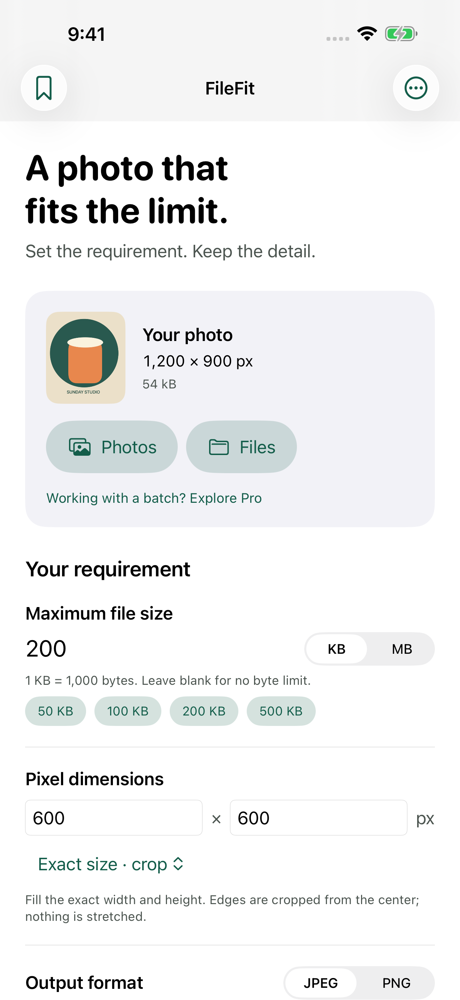
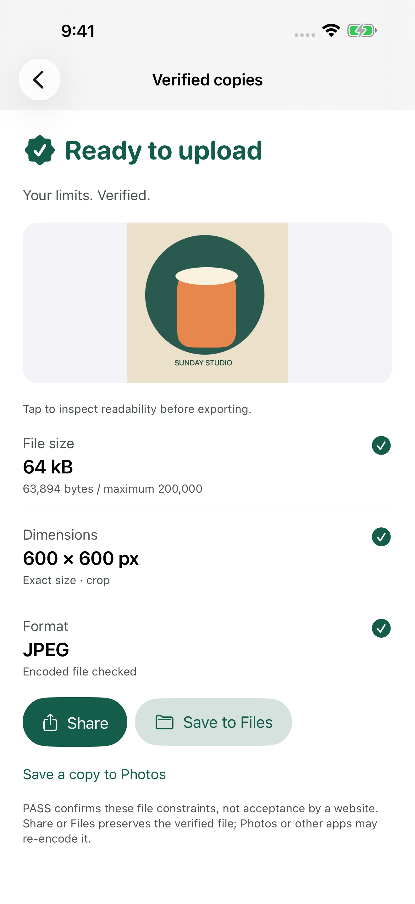

# FileFit · iOS product engineering

**A photo that fits the limit.**

FileFit is a native iPhone utility that prepares still images for uploads with simultaneous file-size, pixel-dimension and format constraints. It creates a separate copy, reads the encoded file back, and reports what passed before export.

**Status:** In development. Not released or submitted to the App Store. FileFit is the engineering codename; consumer naming is reopened. This public repository is a portfolio showcase; commercial application source is maintained privately.

## Problem and product

Application forms often reject an otherwise useful photo because it exceeds a byte limit or has the wrong dimensions. Repeatedly adjusting a JPEG quality slider does not tell the user whether both requirements are satisfied. FileFit turns those requirements into a short workflow:

**Choose photo → Set requirement → Make it fit → Verify → Save or share.**

## Features

- JPEG, PNG and HEIC import from Photos and Files.
- Decimal KB/MB limits together with maximum dimensions, exact center crop, or exact padding.
- JPEG/PNG encoding followed by byte-count, decoded-dimension and format verification.
- Explicit failure when the target cannot be met at the configured quality floor.
- Readability preview, original preservation, Files export, Photos copies and sharing.
- Lifetime Pro for bounded batches, saved requirements and reusable filename prefixes.
- Semantic colors, Dynamic Type, accessibility labels and localization-ready strings.

## Screenshots

Actual development UI captured on 2026-09-26 after the naming correction, using the **FileFit engineering codename**. These are engineering screenshots, not final brand or App Store assets. Previous branded compositions are retired. The image is deterministic developer-owned test content.

| Requirement | Verified output |
| --- | --- |
|  |  |

## Technology and architecture

Swift 6, SwiftUI, Observation, Swift concurrency, ImageIO, Core Graphics, PhotosUI, Photos, UniformTypeIdentifiers and StoreKit 2. No third-party runtime dependencies or backend. iPhone-first with an iOS 17 deployment target; release compatibility still requires device evidence.

An image-processing actor keeps decode/render/encode work away from the main actor. Codable requirement models are separate from UI state. Encoding uses bounded quality search and optional aspect-preserving dimension reduction; exact dimensions never silently shrink. A decoded read-back gate precedes export. Presets use versioned atomic local persistence. StoreKit verifies transactions, restores ownership and handles refunds, pending approvals and cancellation.

See [engineering decisions](ENGINEERING.md) for the implementation tradeoffs.

## Privacy and business model

Image processing is local. Originals are preserved; rendered exports strip source location/camera metadata. No accounts, ads, tracking or remote analytics SDK. Apple handles payments. Free users can finish the complete single-photo task. A proposed US $4.99 non-consumable unlocks reuse features; the actual paywall uses localized StoreKit prices.

[Privacy policy](PRIVACY.md) · [Support](SUPPORT.md)

## Testing

Deterministic synthetic image fixtures exercise transparency, EXIF orientation, HEIC, exact/max dimensions, byte thresholds, malformed input, cancellation and large-image downsampling. StoreKitTest covers verified ownership and edge cases. XCTest UI flows cover the free result, sharing, lifecycle and accessibility checks. Simulator evidence is recorded separately from physical-device and real App Store sandbox verification.

[Dated QA milestone and remaining gates](QA.md).

This showcase does not claim release readiness, revenue, download counts, App Store ranking or user validation.

## App Store

Not available yet. An App Store link will be added only after a real listing exists.

## Portfolio integration

`portfolio-entry.json` is a portable entry for a future master iOS portfolio. Its release status is explicit and its App Store URL is null until launch. The public package contains product screenshots, technical discussion and non-sensitive implementation details; no signing material or production source.

© 2026 sepidehdalir. Portfolio content and product artwork are not licensed for redistribution as an application.
